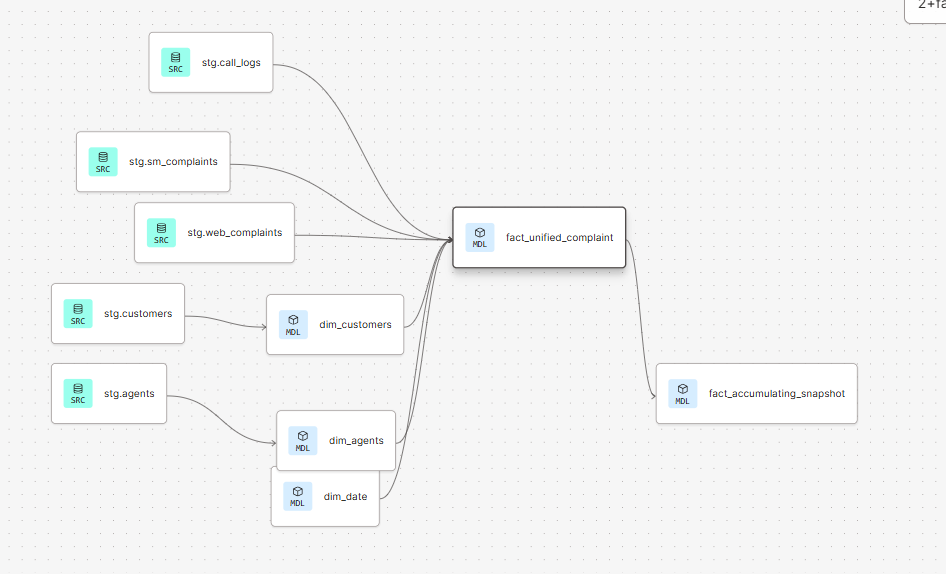

# CoreTelecoms Customer Complaint Pipeline

## Overview
Core Telecoms, a leading telecommunications provider, needed to be proactive with customer support. 
But with complaint data scattered across Postgres databases, CSV dumps, and JSON streams, the company couldn't identify at-risk customers or predict escalations before they happened.

This solution delivers a unified data platform that:
- Ingests data from 5 separate sources into a single source of truth for customer interactions
- Ensures data integrity through referential integrity checks within a conformance layer
- Delivers a dimensional model optimized for analytics and ML feature sets


## Table of Contents

- [Architecture](#architecture)
- [Architectural Decisions](#architectural-decisions)
- [Data Warehouse](#data-warehouse-design)
- [Installation](#installation)


---

## Architecture

### High-Level Data Flow
**Three-Layer Medallion Architecture:**
- **Bronze Layer (S3)**: Raw data extracted from sources, converted to Parquet with lineage manifests
- **Silver Layer (RDS PostgreSQL)**: Validated, conformed data with enforced referential integrity and change tracking
- **Gold Layer (Snowflake)**: Dimensional model optimized for analytics with SCD Type 2 for dimensions

### Data Sources

1. **Customers** - CSV files from S3
2. **Agents** - Google Sheets via API
3. **Ib Complaints** - PostgreSQL database tables
4. **Social Media Complaints** - JSON files from S3
5. **Call Logs** - CSV files from S3

---

## Architectural Decisions

### Orchestration: Conditional Execution and Shortest Path Execution

**Conditional execution**:The DAG uses Airflow's branching operator with state management via Airflow Variables to implement conditional execution:
- Static reference data (customers, agents) loads once on initial run
- Dynamic complaint data loads daily

This significantly reduces processing time and resource consumption on subsequent runs by skipping unnecessary reprocessing of unchanging data. 

**Shortest path execution**: Tasks have dependencies only when necessary and run in parallel wherever possible


### Extraction: Multi-Class Implementation

I Implemented separate extractor classes rather than a single generic extractor because each source has fundamentally different connection patterns:

- **S3Extractor**: Handles file-based sources (CSV, JSON, Excel)
- **SQLExtractor**: Handles PostgreSQL database tables
- **GoogleSheetsExtractor**: Handles Google Sheets API integration

**Shared Behavior**: All extractors convert data to Parquet and generate manifest files for lineage tracking.
This isolates authentication and connection logic  isolated while sharing common behaviors.

---
### Transformation: 
#### Three-Class Architecture

The transformation layer also implements a three-class architecture that separates value cleaning, DataFrame-level validation, and pipeline orchestration into distinct classes with single responsibilities.

**DataCleaner:** Handles individual field cleaning (email validation, phone formatting, timestamp parsing). Contains no orchestration logic, pure transformation functions.

**DataQualityChecker:** Examines raw data and identifies records with validation failures.
It then creates a separate DataFrame of problematic records with original invalid values intact.

**Transformer:**: The Transformer class doesn't do any actual cleaning or validation. Instead, it focuses on workflow: deciding whether to process data in batches or all at once, managing checkpoint state, applying transformations in the correct order, uploading problematic records to S3, and generating  metadata about the transformation run.

#### Double-Pass Strategy
I run validation logic twice, once to identify and preserve problematic data, and again to actually clean the data. This causes a some latency, but the performance cost of this double pass is justified by the observability it provides.

In the first pass, the DataQualityChecker examines the raw data and identifies records with validation failures, and  creates a separate DataFrame of problematic records that still contains the original invalid values. This DataFrame gets uploaded to S3 with complete lineage metadata, creating a permanent record of what data quality issues existed in the source.

In the second pass, the Transformer applies the Cleaner methods to fix or null out invalid values. These cleaned records proceed to the conformance layer for loading. Problematic original data is preserved for investigation, and clean data is loaded without losing information about what Int wrong.

**Trade-off**: Performance cost justified by observability. I maintain a complete audit trail of data quality issues while ensuring clean data reaches the conformance layer.

#### Parallel Processing with ThreadPool

To optimize performance for datasets exceeding 100,000 rows, the transformer switches to parallel processing using Python's ThreadPool. 
I chose ThreadPool over ProcessPoolExecutor due to a specific Airflow constraint: Airflow workers are daemonic processes, and can’t spawn child processes. 

While ThreadPool is limited by Python's Global Interpreter Lock (GIL) for pure Python operations, it still provides  performance improvements for some of the transformation workload as some of my cleaning operations like regex pattern matching in email cleaning release the GIL. 

**Trade-off**: ThreadPool is limited by Python's GIL for pure Python operations, but still provides performance gains for I/O-bound operations and regex pattern matching (which releases the GIL).

## Testing
- **140+ Unit Tests**: Comprehensive test coverage for all transformation logic
---


### Loading: Batched Transform-Load with Checkpointing

#### Batched Transform-Load with Checkpointing
The loading layer implements checkpoint-based recovery enabling resumption from the last successfully loaded batch after failure. This makes the flow of data more resistant to failure and
also reduces resource consumption. in the event of a failure, the maximum amount of rows that will require reprocessing is 100,000.

**Components**:
- **Loader**: Manages data loading to RDS, maintains state about completed batches and rows loaded
- **StateLoader**: Stateless utility retrieving checkpoint information from Airflow Variable on retry
- **LoadState**: Type-safe dataclass representing checkpoint state

After each batch successfully loads, `save_checkpoint()` pushes state to Airflow Variables. On failure, this checkpoint persists and is retrieved on the next retry.

**Batch Size**: 100,000 rows per batch enables handling large datasets without memory constraints, allowing the pipeline to scale without requiring larger EC2 instances.

---

### Conformance Layer: RDS PostgreSQL for FK Enforcement

The five independent data sources have no mechanism to enforce referential integrity. Without a conformance layer, orphaned records would silently corrupt the dimensional model.

**Solution**: I created and maintain an AWS RDS PostgreSQL database that serves as the enforcement point through foreign key constraints. When complaints load daily, PostgreSQL automatically validates that every complaint references valid customer and agent records.

**ACID Guarantees**: PostgreSQL ensures batches either load completely with all FKs satisfied or fail atomically without partial corruption.

**Quarantine Pattern**: Rather than allowing FK violations to reject entire batches, I detect orphaned records *before* attempting the database load. Records referencing non-existent foreign keys are quarantined to `data_quality_quarantine`, ensuring only referentially valid data reaches the conformance layer.

**Change Tracking**: The conformance layer tracks complaint lifecycle evolution (status changes, agent reassignments, detail updates). When updated complaints arrive, Postgres records the changes, enabling the dimensional model in Snowflake to build accumulating snapshots through dbt incremental loading patterns.

**Result**: Analysts can answer questions like "how long did this complaint spend in each status?" with confidence in data integrity.

---

## Data Warehouse Design

The warehouse implements a **star schema** optimized for cross-channel complaint analysis and predictive modeling, consisting of two dimension tables,  complementary fact tables and a ML feature store for customers.


#### Core Dimensions

**`dim_customers`** and **`dim_agents`** form the foundation of the model. Both implement **Type 2 Slowly Changing Dimensions (SCD)** to track historical changes:

- **Customer addresses** are versioned with `address_effective_date` and `address_expiry_date`, enabling analysis of complaint patterns relative to location changes (e.g., "Do complaints increase after customers move to certain zip codes?")


- **Agent experience levels** are versioned with `experience_effective_date` and `experience_expiry_date`, enabling effectiveness tracking as agents gain experience (e.g., "How does resolution time improve as agents move from Tier 1 to Tier 2?")

**Why Type 2 SCD?** Machine learning models benefit from historical context. A churn prediction model can leverage features like "customer moved 3 times in 6 months" or "agent experience level at time of complaint" to improve accuracy.

#### Fact Tables

**`fact_unified_complaint`** (Transaction Fact)
Unnifies three complaint channels (call logs, social media, web forms) into a single queryable table using `UNION ALL`.

**Business Value**: Analysts can query all complaint activity without complex joins. A simple SELECT statement can return omnichannel activity.

**Technical Implementation**: Uses incremental loading strategy (`last_updated_at > MAX(last_updated_at)`) to process only new/changed records, reducing compute costs and query latency.

**Design Trade-off**: Stores `resolution_status` and `resolution_date` despite violating transaction fact immutability principles (facts should not update). This is necessary to feed the accumulating snapshot downstream, which depends on current status to build milestone history. 
I broke a dimensional design rule and accept Type 1 SCD behavior here as a deliberate trade-off.

**`fact_accumulating_snapshot`** (Milestone Tracking)
Tracks complaint lifecycle progression through status milestones: Backlog → In-Progress → Resolved/Blocked.

**Business Value**: Enables SLA monitoring ("How many complaints resolved within 3 days?"), bottleneck identification ("How long do complaints sit in Backlog?"), and workflow optimization ("Which complaint categories take longest to resolve?").

**Technical Implementation**: 
- Uses milestone date preservation logic via `COALESCE(existing.backlog_date, current.backlog_date)` to ensure milestone timestamps are captured once and never overwritten
- Calculates inter-milestone durations (`days_in_progress_to_resolved`) and SLA compliance flags (`met_resolution_sla`)
- Updates existing records via incremental merge, adding new milestones as complaints progress

### Snowflake Performance Optimization

#### Clustering Strategy

Applied clustering keys on **temporal attributes** (`loaded_at`, `last_updated_at`) across all tables to optimize query performance and reduce micro-partition scanning costs.

**Why temporal clustering?** 
- My surrogate keys are hash values and therefore exhibit random distribution with no sequential locality. Clustering on these provides no pruning benefits
- Temporal fields create **sequential data waves**: `loaded_at` reflects DAG execution batches, creating clear time-based partitions that align with common query patterns ("show me complaints from last week")
- Snowflake's automatic clustering maintenance is most effective when values show temporal progression

**Query Performance Impact**: Time-range queries (`WHERE loaded_at >= '2024-01-01'`) benefit from partition pruning, scanning only relevant micro-partitions instead of full table scans.

---

### Schema Evolution & Maintenance

**Incremental Loading**: All fact tables use `on_schema_change='append_new_columns'` to handle schema evolution gracefully. If source systems add new complaint attributes, they flow through automatically without breaking existing queries.

**Data Freshness**: The `loaded_at` timestamp enables monitoring data recency, critical for ML models that require fresh features for accurate predictions.

**SCD Maintenance**: Type 2 logic automatically expires old versions and creates new versions when dimension attributes change, preserving complete audit history while maintaining current-state query performance.

---

## Key Technical Challenges Solved

### 1. Conditional Orchestration with FK Constraints
**Problem**: Static data (customers, agents) loads once; complaints load daily. Complaints have FK dependencies requiring strict ordering on first run but not subsequent runs.

**Solution**: Gate pattern with dual-path triggering:
- First run: `branch → static loads → mark_complete → gate → complaints`  
- Subsequent runs: `branch → gate → complaints` (static skipped)

Uses `none_failed_min_one_success` trigger rule so gate opens when *either* upstream succeeds. [Implementation](docs/orchestration.md)

### 2. Orphaned Records at Scale
**Problem**: 5 independent sources can reference non-existent customers/agents, corrupting the dimensional model.

**Solution**: Quarantine pattern compares incoming FKs against conformance layer *before* database load. Invalid records isolated to `data_quality_quarantine`, valid records proceed. 
PostgreSQL FK constraints never fire—violations caught upstream. [Implementation](docs/quarantine.md)

### 3. Checkpoint-Based Recovery
**Problem**: Processing millions of rows in single transaction risks memory exhaustion and catastrophic failure.

**Solution**: 100k-row batches with Airflow Variable checkpoint storage. On failure, resume from last successful batch. [Implementation](docs/orchestration.md)


## Tech Stack & Engineering Decisions

| Component | Technology | Problem Solved | Decision Rationale |
|-----------|-----------|----------------|-------------------|
| **Orchestration** | Apache Airflow 3.0 | Conditional execution with FK dependencies | Implemented gate pattern with `none_failed_min_one_success` trigger rule for dual-path triggering (first run vs subsequent runs) |
| **Conformance Layer** | RDS PostgreSQL | Orphaned records from 5 independent sources | Quarantine pattern detects FK violations before load, preventing rejections while preserving bad data for investigation |
| **Recovery** | Checkpoint System | Large dataset failures requiring full reprocessing | Batched transform-load with Variable state management enables resume from last successful batch (~80% cost reduction on retry) |
| **Data Quality** | Double-Pass Validation | Silent quality issues reaching production | First pass quarantines bad records to S3, second pass cleans valid records—maintains audit trail without information loss |
| **Warehouse** | Snowflake | Cross-channel complaint analysis + ML features | Star schema with temporal clustering on `loaded_at`, SCD Type 2 for historical context in churn models |
| **Testing** | pytest + 140+ tests | Regression prevention | Comprehensive coverage across transformation logic|


## Installation
```bash
# 1. Deploy infrastructure
cd infra && terraform init && terraform apply

# 2. Configure credentials
cp .env.example .env  # Add your AWS credentials

# 3. Start pipeline
docker-compose up -d
```

**Full setup guide**: See [docs/installation.md](docs/installation.md) for detailed instructions including:
- Infrastructure setup with Terraform
- Environment variable configuration
- Database schema initialization
- Airflow connection setup
- Google service account configuration

**Prerequisites**: Docker, Terraform, AWS CLI, configured AWS account

---
