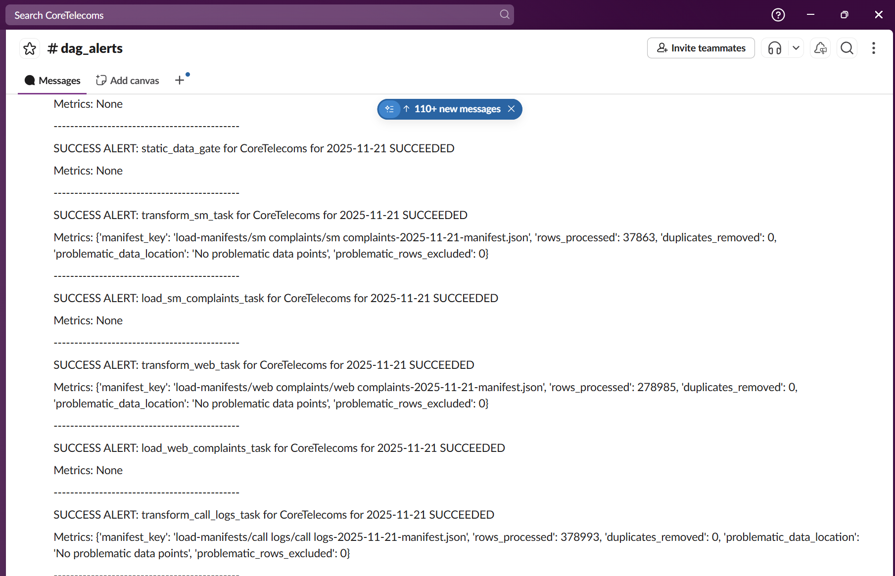
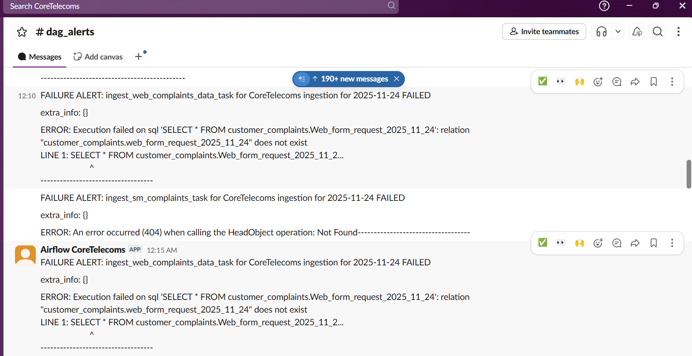

## Observability & Monitoring

### Contextual Observability

The pipeline implements multi-layer observability with rich metadata at every stage, propagated through Airflow XCom and surfaced in Slack alerts with actionable context.


**Taking advantage of Metadata flowing through the pipeline through XComs** 

1. **Failures preserve context** What was being processed when it failed
2. **Alerts are actionable** They include enough info to diagnose without logging into Airflow
3. **Graceful degradation** Missing Slack connection logs warning, and doesn't crash pipeline

---

### Implementation

#### 1. Metadata Generation at Each Stage

**Extraction Layer**:
```python
def copy_customers_data(self) -> Dict:
    """Extract customers and return metadata."""
    # ... extraction logic ...
    
    manifest = {
        "source": "s3://source-bucket/customers.csv",
        "destination": "s3://bronze/customers/customers-2024-01-15.parquet",
        "execution_date": self.execution_date,
        "metrics": {
            "row_count": len(df),
            "file_size_mb": file_size / (1024 * 1024)
        },
        "lineage": {
            "dag_id": self.context["dag"].dag_id,
            "task_id": self.context["task_instance"].task_id,
            "run_id": self.context["run_id"]
        }
    }
    
    # Push to XCom for downstream tasks
    self.context["task_instance"].xcom_push(key="metadata", value=manifest)
    
    return manifest
```


**Transformation Layer**:
```python
def transform_entity(self, s3_path: str, entity_type: str) -> Dict:
    """Transform entity and return metadata."""
    # ... transformation logic ...
    
    manifest = {
        "entity": entity_type,
        "source": s3_path,
        "destination": f"s3://bronze/transformed/{entity_type}-{self.execution_date}.parquet",
        "execution_date": self.execution_date,
        "metrics": {
            "rows_input": len(raw_df),
            "rows_output": len(clean_df),
            "rows_problematic": len(problematic_df),
            "data_quality_rate": f"{(1 - len(problematic_df)/len(raw_df)) * 100:.2f}%"
        },
        "problematic_data_path": problematic_s3_path,
        "lineage": {
            "dag_id": self.context["dag"].dag_id,
            "task_id": self.context["task_instance"].task_id,
            "run_id": self.context["run_id"]
        }
    }
    
    self.context["task_instance"].xcom_push(key="metadata", value=manifest)
    
    return manifest
```

**Load Layer**:
```python
def load_tables_to_snowflake(self, entity_type: str) -> None:
    """Load to Snowflake and track metrics."""
    # ... load logic ...
    
    manifest = {
        "entity": entity_type,
        "table": f"conformed_{entity_type.replace(' ', '_')}",
        "execution_date": self.execution_date,
        "metrics": {
            "rows_loaded": self.rows_loaded,
            "rows_quarantined": quarantine_count
        },
        "lineage": {
            "dag_id": self.context["dag"].dag_id,
            "task_id": self.context["task_instance"].task_id,
            "run_id": self.context["run_id"]
        }
    }
    
    self.context["task_instance"].xcom_push(key="metadata", value=manifest)
```


#### 2. Success Notifications (Metrics Visibility)
```python
def success_notification(context: Context):
    """
    Send success notification with processing metrics.
    Gracefully handles missing Slack connection.
    """
    try:
        ti = context["task_instance"]
        metadata = ti.xcom_pull(task_ids=ti.task_id, key="metadata")
        
        # Format metrics for readability
        details = (
            f"SUCCESS: {ti.task_id} for CoreTelecoms ({context['ds']})\n\n"
            f"Metrics:\n"
            f"  • Rows Processed: {metadata.get('metrics', {}).get('rows_input', 'N/A')}\n"
            f"  • Rows Loaded: {metadata.get('metrics', {}).get('rows_output', 'N/A')}\n"
            f"  • Data Quality: {metadata.get('metrics', {}).get('data_quality_rate', 'N/A')}\n\n"
            f"Lineage:\n"
            f"  • Source: {metadata.get('source', 'N/A')}\n"
            f"  • Destination: {metadata.get('destination', 'N/A')}\n"
            f"---------------------------------------------\n"
        )
        
        notifier = SlackNotifier(
            slack_conn_id="slack", 
            text=details, 
            channel="dag_alerts"
        )
        notifier.notify(context)
        
    except AirflowNotFoundException:
        log.warning("Slack connection not configured, skipping notification")
    except Exception as e:
        log.error(f"Failed to send success notification: {e}")
        # Don't fail the task because notification failed
```

---

#### 3. Failure Notifications (Diagnostic Context)
```python
def failure_notification(context: Context):
    """
    Send failure notification with diagnostic context.
    Includes metadata about what was being processed when failure occurred.
    """
    try:
        ti = context["task_instance"]
        metadata = ti.xcom_pull(task_ids=ti.task_id, key="metadata") or {}
        exception = context.get("exception")
        
        details = (
            f"FAILURE: {ti.task_id} for CoreTelecoms ({context['ds']})\n\n"
            f"Error: {str(exception)[:500]}\n\n"  # Truncate long stack traces
            f"Context:\n"
            f"  • Execution Date: {context['ds']}\n"
            f"  • Try Number: {ti.try_number}\n"
            f"  • Source File: {metadata.get('source', 'Unknown')}\n"
            f"  • Rows Processed: {metadata.get('metrics', {}).get('rows_input', 'Unknown')}\n\n"
            f"Checkpoint State:\n"
            f"  • Last Batch: {metadata.get('checkpoint', {}).get('last_batch', 'N/A')}\n"
            f"  • Rows Loaded: {metadata.get('checkpoint', {}).get('rows_loaded', 'N/A')}\n\n"
            f"Action Required: Check Airflow logs for full stack trace\n"
            f"Airflow Link: {ti.log_url}\n"
            f"---------------------------------------------\n"
        )
        
        notifier = SlackNotifier(
            slack_conn_id="slack",
            text=details,
            channel="dag_alerts"
        )
        notifier.notify(context)
        
    except AirflowNotFoundException:
        log.warning("Slack connection not configured, skipping notification")
    except Exception as e:
        log.error(f"Failed to send failure notification: {e}")
```

**Slack Output (Failure Example)**:
```
 FAILURE: load_call_logs_task for CoreTelecoms (2024-01-15)

Error: psycopg2.errors.UniqueViolation: duplicate key value violates unique constraint "conformed_call_logs_pkey"
----------------------------
```


#### 5. Middleware for Early Metadata Preservation
```python
def persist_ingestion_metadata_before_failure(
    error: Exception, 
    context: Context, 
    metadata: Dict
) -> None:
    """
    Middleware that ensures metadata is preserved even if task fails
    before XCom push completes.
    
    Used in extraction tasks where failure can occur before manifest
    is fully written.
    """
    info = {
        "task": context["task_instance"].task_id,
        "execution_date": metadata.get("execution_date"),
    }
    
    # Merge additional metadata
    for key, value in metadata.items():
        info[key] = value
    
    # Extract non-standard fields
    extra_info = {
        k: v for k, v in info.items() 
        if k not in ["task", "execution_date"]
    }
    
    details = (
        f"EARLY FAILURE: {info['task']} ({info['execution_date']})\n\n"
        f"Failed during extraction phase\n\n"
        f"Partial Metadata:\n"
        f"{json.dumps(extra_info, indent=2)}\n\n"
        f"Error: {error}\n"
        f"---------------------------------------------\n"
    )
    
    notifier = SlackNotifier(
        slack_conn_id="slack",
        text=details,
        channel="dag_alerts"
    )
    notifier.notify(context)
    
    # Re-raise to ensure task fails
    raise error
```

**Use Case**: S3 extraction fails after downloading but before manifest is written.

**Without Middleware**:
```
FAILURE: ingest_call_logs_task
Error: ConnectionError
[No additional context]
```

**With Middleware**:
```
FAILURE: ingest_call_logs_task (2024-01-15)

Failed during extraction phase

 Metadata:
{
  "source": "s3://source-bucket/call-logs-2024-01-15.csv",
  "bytes_downloaded": 524288000,
  "rows_read": 456789
}

Error: xxxxxxxxxx
---------------------------------------------
```
