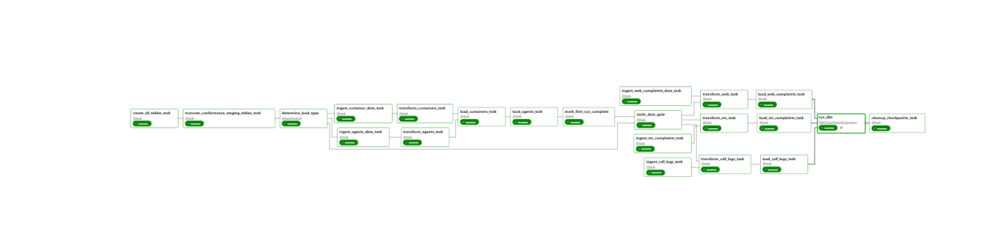
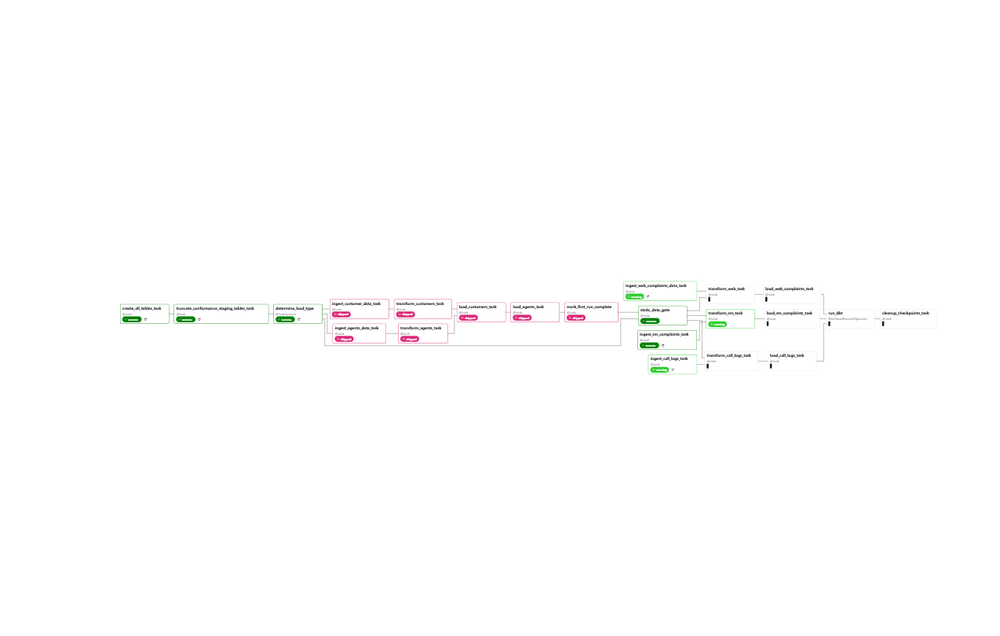

## Conditional Orchestration with Gate Pattern

### The Problem

The pipeline presented an orchestration challenge:

**Requirement 1**: Static reference data (customers, agents) should load **once** on the first run to avoid wasting compute  
**Requirement 2**: Dynamic complaint data should load **daily**  
**Requirement 3**: Complaints have FK constraints to customers/agents, requiring strict ordering on first run  
**Requirement 4**: On subsequent runs, complaints must process immediately without waiting for static data (which is skipped)

**The Conflict**: How do you make complaints wait for static data on Day 1, but process immediately on Day 2+ when static tasks are skipped?

Considerations:
- **Conditional logic in tasks**: Violates separation of concerns, untestable
- **Separate DAGs**: Coordination complexity, fragile dependencies

---

### The Solution: Dual-Path Gate with Trigger Rule

The gate pattern creates a synchronization point with **two upstream paths**. The gate opens when *either* path succeeds, correctly handling skipped tasks in both scenarios.

#### Architecture
```
                    ┌─────────────┐
                    │   branch    │
                    └──────┬──────┘
                           │
                ┌──────────┼──────────┐
                │                     │
         ┌──────▼──────┐       ┌─────▼─────┐
         │ customers/  │       │   gate    │
         │ agents load │       │ (skipped  │
         └──────┬──────┘       │ upstream) │
                │              └─────┬─────┘
         ┌──────▼──────┐             │
         │mark_complete│             │
         └──────┬──────┘             │
                │                    │
                └────────┬───────────┘
                         │
                   ┌─────▼─────┐
                   │   gate    │ ◄── trigger_rule="none_failed_min_one_success"
                   └─────┬─────┘
                         │
                   ┌─────▼─────┐
                   │ complaints│
                   └───────────┘
```

**First Run**: branch ->> static loads ->> mark_complete ->> gate ->> complaints  

**Subsequent Runs**: branch ->> gate ->> complaints (static path skipped)


---

### Implementation

#### 1. Branch Task (Decision Point)
```python
@task.branch
def determine_load_type():
    """Routes execution based on first-run state."""
    is_first_run = Variable.get("coretelecoms_first_run", default_var="true")
    
    if is_first_run.lower() == "true":
        log.info("First run - must load static data before gate opens")
        return [
            "ingest_customer_data_task",
            "ingest_agents_data_task", 
            "static_data_gate"
        ]
    else:
        log.info("Subsequent run - gate opens immediately")
        return ["static_data_gate"]
```

**Key Decision**: The gate ID (`"static_data_gate"`) is included in *both* return paths. This ensures the gate task is always triggered by the branch, regardless of execution type.

#### 2. Gate Task (Synchronization Point)
```python
@task(task_id="static_data_gate", trigger_rule="none_failed_min_one_success")
def static_data_gate():
    """
    Synchronization gate for FK constraint enforcement.
    
    Trigger rule ensures gate opens when EITHER upstream succeeds:
    - First run: mark_complete succeeds ->> gate opens
    - Subsequent runs: branch succeeds ->> gate opens (mark_complete skipped)
    """
    log.info("Static data gate OPEN. Complaints can now be processed")
    return True
```

**Critical Configuration**: `trigger_rule="none_failed_min_one_success"`

This trigger rule means:
- Run if **at least one** upstream task succeeded
- AND **no** upstream tasks failed
- Skipped tasks are **ignored** (not counted as failures)

#### 3. State Management
```python
@task
def mark_first_run_complete():
    """
    Persists first-run state to prevent redundant static loads.
    
    CRITICAL: If this fails, static data reloads daily (wasted compute).
    """
    Variable.set("coretelecoms_first_run", "false")
    log.info("First run complete - subsequent runs will skip static data")
```

**Failure Mode**: If `mark_first_run_complete` fails after static loads succeed, the variable remains `"true"`. Next run repeats static loads. This is **safe** (idempotent) but **expensive** (unnecessary reprocessing).

---

### Dependency Graph
```python
# Setup
tables = create_all_tables_task()
clear_staging = truncate_conformance_staging_tables_task()
branch = determine_load_type()

tables >> clear_staging >> branch

# Static path (conditional)
raw_customer_data = ingest_customer_data_task()
raw_agents_data = ingest_agents_data_task()

branch >> [raw_customer_data, raw_agents_data]

transform_customers = transform_customers_task(raw_customer_data)
transform_agents = transform_agents_task(raw_agents_data)

load_customers_wh = load_customers_task()
load_agents_wh = load_agents_task()

[transform_customers, transform_agents] >> load_customers_wh >> load_agents_wh >> mark_complete

# Gate with dual upstream paths
open_gate = static_data_gate()

mark_complete >> open_gate  # Path 1: After static loads complete
branch >> open_gate          # Path 2: Direct from branch (subsequent runs)

# Dynamic path (always runs, but waits for gate)
raw_call_logs = ingest_call_logs_task()
raw_sm_complaints = ingest_sm_complaints_task()
raw_web_complaints = ingest_web_complaints_data_task()

transform_call_logs = transform_call_logs_task(raw_call_logs)
transform_sm = transform_sm_task(raw_sm_complaints)
transform_web = transform_web_task(raw_web_complaints)

open_gate >> [transform_call_logs, transform_sm, transform_web]  # Gate blocks complaints
```

### Execution Flow

#### **First Run (2025-11-20)**
```
1. tables ->> clear_staging ->> branch
2. branch determines is_first_run=true
3. branch triggers: [ingest_customer_data, ingest_agents_data, static_data_gate]
4. Static loads run in parallel:
   - ingest_customer_data ->> transform_customers ->> load_customers_wh
   - ingest_agents_data ->> transform_agents ->> load_agents_wh
5. load_customers_wh ->> load_agents_wh ->> mark_complete
6. mark_complete sets Variable("coretelecoms_first_run") = "false"
7. mark_complete ->> static_data_gate (Path 1 activates gate)
8. Gate opens, complaints transform and load
9. trigger_dbt ->> cleanup_checkpoints
```

#### **Subsequent Run (2025-11-21)**
```
1. tables ->> clear_staging ->> branch
2. branch determines is_first_run=false
3. branch triggers: [static_data_gate]
4. Static tasks show as "skipped" (not in branch return list)
5. mark_complete shows as "skipped" (upstream skipped)
6. branch ->> static_data_gate (Path 2 activates gate)
7. Gate opens immediately, complaints transform and load
8. trigger_dbt ->> cleanup_checkpoints
```
